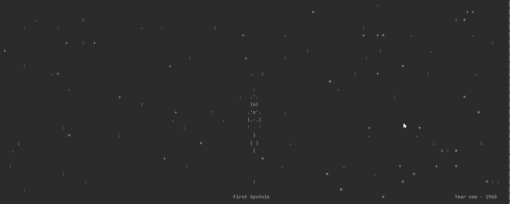

# Игра "Очисти космос от мусора"

Это тренировка программирования на асинхронном пайтоне. 
Игра в которой реализовано:
- наполнение экрана звездами в произвольном порядке, которые мигают по заданному алгоритму
- отрисовка космического корабля с постоянно двигающимся хвостом
- возможность управления кораблем, движение, стрельба
- появление мусора на экране в произвольном месте с увеличением количества в зависимости от продолжительности игры
- возможность уничтожать мусор из пушки
- при столкновении корабля с мусором - взрыв и конец игры

Игру запускаем файлом `rocket.py`

## Пример игры:

## Цели проекта

Код написан в учебных целях — это урок в курсе по Python и веб-разработке на сайте [Devman](https://dvmn.org).
